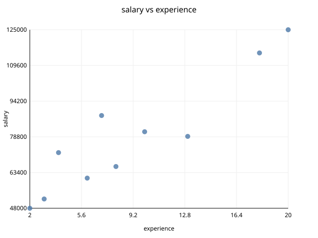

# Data Analytics Library (C++)

A small, object-oriented data analytics library in modern C++ (C++20). It loads tabular data, computes statistics, filters rows, exports to CSV/JSON, and exports scatter plots as SVG images.

It is built to show OOP design: inheritance, multiple and virtual inheritance, runtime polymorphism, templates, exception handling, and smart-pointer memory management. See **[explanations.md](explanations.md)** for the design reasoning.

## Features
- **DataSet** with typed columns (`Column<int>`, `Column<double>`, `Column<string>`)
- **CSV import** with automatic column type inference
- **Analytics:** mean and median (Strategy pattern), run together through a `StatisticsEngine`
- **Filtering** with any lambda, for example `ds.filterBy("age", [](double a) { return a > 30; })`
- **Export** to CSV and JSON
- **SVG scatter plot** of any two numeric columns (open it in any browser)
- **Custom exception hierarchy**

## Project structure
```
.
├── include/
│   ├── Exceptions.hpp   # DataException hierarchy
│   ├── ColumnBase.hpp   # abstract column interface
│   ├── Column.hpp       # Column<T> template (header-only)
│   ├── Filter.hpp       # condition on a column
│   ├── DataSet.hpp      # central entity, owns the columns
│   ├── Analyzer.hpp     # IAnalyzer, Mean/Median, StatisticsEngine
│   ├── IO.hpp           # FileFormat, IImporter, IExporter, CSVHandler, JSONExporter
│   └── Visualizer.hpp   # IVisualizer, ScatterPlot (SVG)
├── src/
│   ├── DataSet.cpp
│   ├── Filter.cpp
│   ├── Analyzer.cpp
│   ├── IO.cpp
│   ├── Visualizer.cpp
│   └── main.cpp         # demo program
├── data/employees.csv   # sample data
├── Makefile
├── explanations.md
└── README.md
```

## Build and run
You need g++ 10 or newer (any compiler with C++20 support).

```bash
make          # build ./analytics
make run      # build and run the demo
make clean    # remove build files and generated output
```

The demo writes `scatter.svg`, `output.csv` and `output.json` (the last two hold the rows where age > 30) in the project root.

## Usage
```cpp
#include "Analyzer.hpp"
#include "DataSet.hpp"
#include "IO.hpp"
#include "Visualizer.hpp"

DataSet ds;
ds.loadCSV("data/employees.csv");
ds.print();

StatisticsEngine engine;
engine.addAnalyzer(make_unique<MeanAnalyzer>());
engine.addAnalyzer(make_unique<MedianAnalyzer>());
engine.report(*ds.getColumn("salary"));

DataSet seniors = ds.filterBy("age", [](double a) { return a > 30; });

ScatterPlot().plot(ds, "experience", "salary", "scatter.svg");

JSONExporter().exportTo(seniors, "seniors.json");

auto& ages = ds.getColumnAs<int>("age");   // typed access

try {
    ds.getColumn("bonus");
} catch (const ColumnNotFoundException& e) {
    cerr << e.what() << '\n';
}
```

Building a dataset by hand:
```cpp
DataSet manual;
auto col = make_unique<Column<double>>("score");
col->addValue(9.5);
manual.addColumn(move(col));
```

## Scatter plot
`ScatterPlot(width, height, color)` writes an SVG file. It has a title, grid lines, axis labels and ticks, and a hover tooltip on every point. Defaults: 640×480 px, color `#4C78A8`. The path must end in `.svg`, otherwise it throws `FileException`.



*(Run `make run` to generate `scatter.svg`.)*

## Extending the library
- **New statistic:** subclass `IAnalyzer` and override `analyze()` and `name()`.
- **New file format:** subclass `IImporter` and/or `IExporter` and override `extension()`.
- **New chart type:** subclass `IVisualizer` and override `plot()`.

## Limitations
Filters only work on numeric columns, the CSV parser doesn't handle quoted fields, and JSON can only be exported, not imported. See [explanations.md](explanations.md#7-known-limitations-kept-out-deliberately-for-simplicity).
